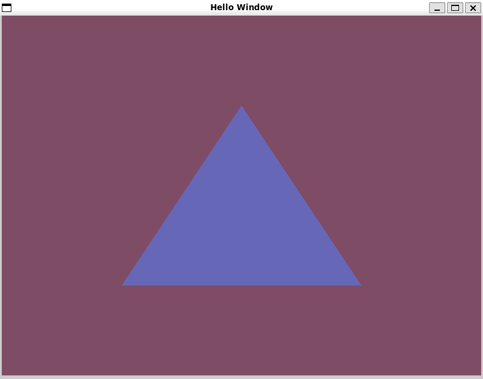

# Creating a triangle

[link to book chapter — hello_triangle](https://learnopengl.com/Getting-started/Hello-Triangle)

# Contents

* [But first](#but-first)
    * [Graphic Pipeline](#graphic-pipeline)
    * [GLAD](#glad)
* [Hello Window](#hello-window)

# But first...

We need to understand that our world is 3D-oriented. But the screen is 2D. Although it's an obvious observation, it's
important to say so. The process of transforming 3D coordinates into 2D pixels is called <b>graphics pipeline</b>.

## Graphic pipeline

we can divide it into two main parts:

* Transforming 3D coordinates into 2D coordinates
* Transforming those coordinates into coloured pixels.

### [Input](#vertex-input)

the graphic pipeline takes a list of 3d coordinates that resembles a triangle. each line is called a <u> vertice</u>.
a <b>_Vertex_</b> is a collection of data/3D coordinate.

In order for OpenGL to know how to render our data, we need to provide it with a hint which often called premetives:

* `GL_POINTS` - rendering as unrelated points.
* `GL_TRIANGLES` - rendering as a triangle.
* `GL_LINE_STRIP` - rendering as a line.

### [Vertex shader (stage)](#vertex-shader)

Takes the input of a single vertex and transforms its 3DC[^1] into other 3DC (will be explained later)and normalizes
the data for the next step

### Geometry shader (optional)

Takes input a collection of vertices the form a primitive and generates and form other (and even new) primitives.

### Primitive assembly

Takes all the vertices (vertex if we chose `GL_POINTS`) from previous step and assembles it as points.

### Rasterization

Takes the vertices and makes a bitmap out of them. (extremely simplified.. )<br>
[Wikepedia link](https://en.wikipedia.org/wiki/Rasterisation)

### Fragment shader

A fragment is all the data needed for OpenGl to render a pixel.<br>
this step is making the colour of the pixel. this is where most magic happens

### Test and blending

Checks the fragment's data, tests if it "blocks the view" of other objects. It's also checks the alpha (transperacy)
values and blends the object's accordingly.

# Vertex input

OpenGl is for 3D rendering. so, (even if we wnat to render 2D) so we'll need to provide it with 3D coordinates.

example for an input:

```c
float vertices[] = {
     -0.5f, -0.5f, 0.0f,
     0.5f, -0.5f, 0.0f,
     0.0f,  0.5f, 0.0f
};
```

this is just random bits. so we'll need to tell the vertex shader how to interperet them.

in order to manage the objects we send to the graphic card, we'll use <b>*vertex buffer object* (VBO) </b>.

```c
unsigned int VBO;
glGenBuffers(1, &VBO);  
```

after we generate the buffer and bind it with `glBindBuffer`, we need to copy the data with:

```c
glBufferData(GL_ARRAY_BUFFER, sizeof(vertices), vertices, GL_STATIC_DRAW);
```

here we tell the type of buffer, it's size, the data and how the data will be used:

* `GL_STREAM_DRAW`: the data is set only once and used by the GPU at most a few times.
* `GL_STATIC_DRAW`: the data is set only once and used many times.
* `GL_DYNAMIC_DRAW`: the data is changed a lot and used many times.

# Vertex shader

one of the progremmable shaders by the user, will be discussed more in next chapter
the shader is a compiled program (compiled at runtime) that we need to send to the card.

## compiling the shader

```c
const char* shader_source = "GLSL_SOURCE_CODE";
unsigned int vertext_shader = glCreateShader(GL_VERTEX_SHADER); //returns 0 if error
glShaderSource(vertex_shader, 1, &shader_source, NULL);
glCompileShader(vertex_shader);
```

# Fragment Shader

The sceond and final shader that is progremable by the user.

in computer graphics, we use 4 data points to handle colour:

* R
* G
* B
* A(lpha) - which is the opacity

as the vertex shader before, we'll need to copile it as well

```c
unsigned int fragmentShader;
fragmentShader = glCreateShader(GL_FRAGMENT_SHADER);
glShaderSource(fragmentShader, 1, &fragmentShaderSource, NULL);
glCompileShader(fragmentShader);
```

# Shader program

now that we set up all the data to have a trianangle, we'll need a program to run it!

```c
unsigned int shaderProgram;
shaderProgram = glCreateProgram();
```

and attach the shaders

```c
glAttachShader(shaderProgram, vertexShader);
glAttachShader(shaderProgram, fragmentShader);
glLinkProgram(shaderProgram);
```

# Linking Vertex Attributes

we're almoast there, just need to tell openGL how to interperet the data.

```c
glVertexAttribPointer(0, 3, GL_FLOAT, GL_FALSE, 3 * sizeof(float), (void*)0);
glEnableVertexAttribArray(0); 
```

let's explain:

* the location we configured in the [Vertex Shader](#vertex-shader)
* size of the data we send, (3. because we use vec3 in this particular case)
* the type of the data
* wether or not we should normalize the data (ususallu, we don't need to normalize float)
* stride: the length of datapoint
* offset to where the data begin

so in order to draw an object we'll need:

```c
// 0. copy our vertices array in a buffer for OpenGL to use
glBindBuffer(GL_ARRAY_BUFFER, VBO);
glBufferData(GL_ARRAY_BUFFER, sizeof(vertices), vertices, GL_STATIC_DRAW);
// 1. then set the vertex attributes pointers
glVertexAttribPointer(0, 3, GL_FLOAT, GL_FALSE, 3 * sizeof(float), (void*)0);
glEnableVertexAttribArray(0);
// 2. use our shader program when we want to render an object
glUseProgram(shaderProgram);
// 3. now draw the object 
someOpenGLFunctionThatDrawsOurTriangle(); 
```

that's a long and ridious process.
so we'll use [Vertex Array Object](#vertex-array-object-vao)

## Vertex array object (VAO)

In general, VBO array.
Behind the schenes it looks something like:<br>


so from now on, we will bind the *VBO* into the VAO.

but first we need to create it

```c
unsigned int VAO;
glGenVertexArray(1, &VAO)
```

and now, USE IT!

```c
// ..:: Initialization code (done once (unless your object frequently changes)) :: ..
// 1. bind Vertex Array Object
glBindVertexArray(VAO);
// 2. copy our vertices array in a buffer for OpenGL to use
glBindBuffer(GL_ARRAY_BUFFER, VBO);
glBufferData(GL_ARRAY_BUFFER, sizeof(vertices), vertices, GL_STATIC_DRAW);
// 3. then set our vertex attributes pointers
glVertexAttribPointer(0, 3, GL_FLOAT, GL_FALSE, 3 * sizeof(float), (void*)0);
glEnableVertexAttribArray(0);


[...]

// ..:: Drawing code (in render loop) ::..
// 4. draw the object
glUseProgram(shader_program);
glBindVertexArray(VAO);
```

and now to drawing or triangle!

```c 
glDrawArrays(GL_TRIANGLES, 0, 3);
```

this function takes:

* render type[^2], what we want to render
* starting index of our array
* how many vertices there are

and if we did everything right, now there will be a magnivicent triangle!


# Element Buffer Object (EBO)

suppose we want to create a rectangle, that is combined from two triangle (OpenGL works with triangles)

```c
float vertices[] = {
    // first triangle
     0.5f,  0.5f, 0.0f,  // top right
     0.5f, -0.5f, 0.0f,  // bottom right
    -0.5f,  0.5f, 0.0f,  // top left 
    // second triangle
     0.5f, -0.5f, 0.0f,  // bottom right
    -0.5f, -0.5f, 0.0f,  // bottom left
    -0.5f,  0.5f, 0.0f   // top left
}; 
```
we can see that there is some overlap between the two.
what we could do instead is use four vertices, and then tell openGl what are the triangles!

```c
float vertices[] = {
     0.5f,  0.5f, 0.0f,  // top right
     0.5f, -0.5f, 0.0f,  // bottom right
    -0.5f, -0.5f, 0.0f,  // bottom left
    -0.5f,  0.5f, 0.0f   // top left 
};

unsigned int indices[] = {  // note that we start from 0!
    0, 1, 3,   // first triangle
    1, 2, 3    // second triangle
};  
```

this is sometimes called *index drawing*. now let's create and use it

```c
unsigned int EBO;
glGenBuffers(1, &EBO);
```

it's quite similar to the VBO, but this time we'll use `GL_ELEMENT_ARRAY_BUFFER` instead of `GL_TRIANGLES`;

```c
glBindBuffer(GL_ELEMENT_ARRAY_BUFFER, EBO);
glBufferData(GL_ELEMENT_ARRAY_BUFFER, sizeof(indices), indices, GL_STATIC_DRAW); 

glBindBuffer(GL_ELEMENT_ARRAY_BUFFER, EBO);
glDrawElements(GL_TRIANGLES, 6, GL_UNSIGNED_INT, 0);
```
`glDrawElements` is as same as before, but this time we are drawing *6* vertices. (look at the indices)

the relationship between *VAO*, *VBO*, and *EBO* looks like that:


and now our code would lok like:

```c
// ..:: Initialization code ::..
// 1. bind Vertex Array Object
glBindVertexArray(VAO);
// 2. copy our vertices array in a vertex buffer for OpenGL to use
glBindBuffer(GL_ARRAY_BUFFER, VBO);
glBufferData(GL_ARRAY_BUFFER, sizeof(vertices), vertices, GL_STATIC_DRAW);
// 3. copy our index array in a element buffer for OpenGL to use
glBindBuffer(GL_ELEMENT_ARRAY_BUFFER, EBO);
glBufferData(GL_ELEMENT_ARRAY_BUFFER, sizeof(indices), indices, GL_STATIC_DRAW);
// 4. then set the vertex attributes pointers
glVertexAttribPointer(0, 3, GL_FLOAT, GL_FALSE, 3 * sizeof(float), (void*)0);
glEnableVertexAttribArray(0);  

[...]
  
// ..:: Drawing code (in render loop) :: ..
glUseProgram(shaderProgram);
glBindVertexArray(VAO);
glDrawElements(GL_TRIANGLES, 6, GL_UNSIGNED_INT, 0);
glBindVertexArray(0);
```


[^1]: 3D Coordinates
[^2]: see [input](#input)


