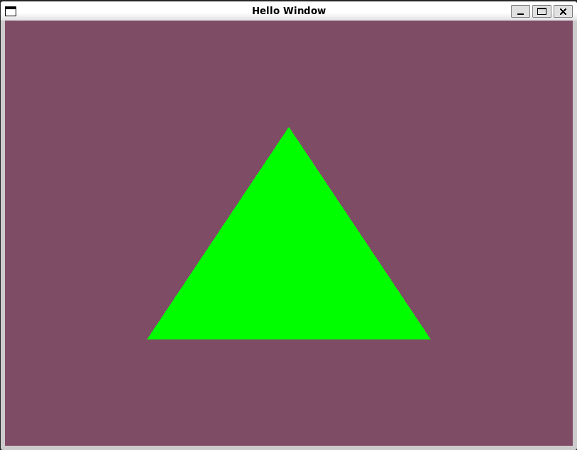
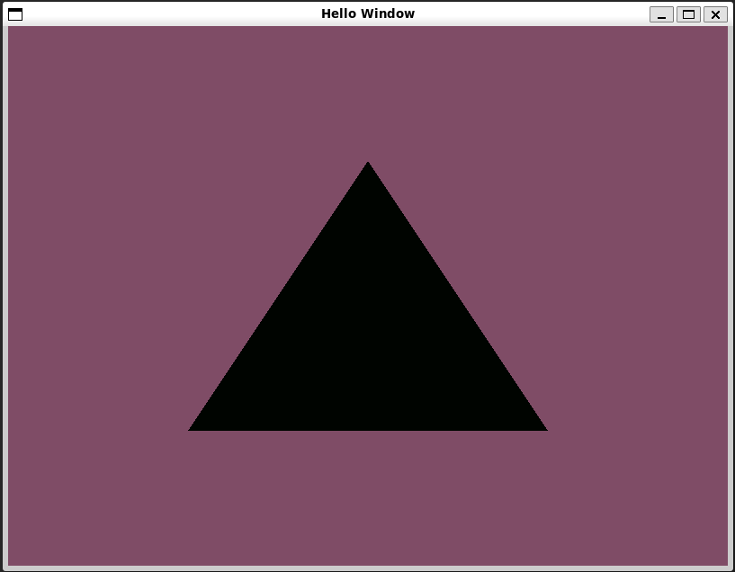
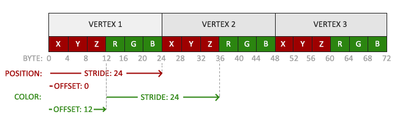
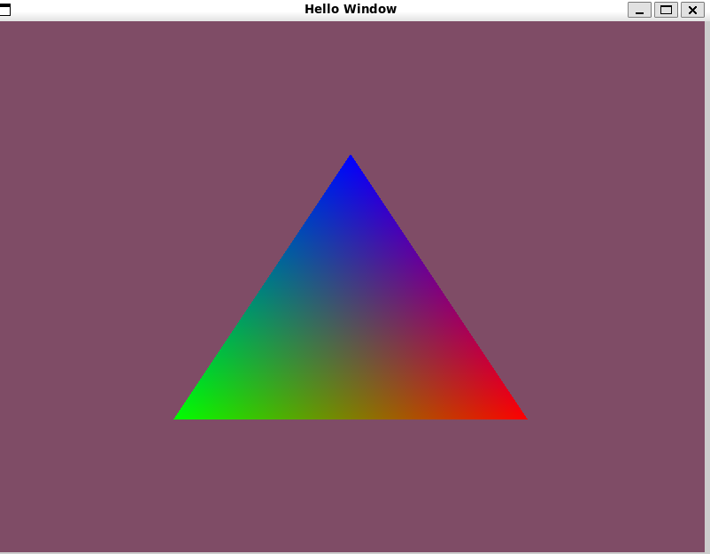

# Shaders

[link to chapter](https://learnopengl.com/Getting-started/Shaders)
___

Shaders are isolated programs (not allowed to talk with other shader programs) that live on the GPU.

# table of contents

* [GLSL](#glsl)
*
    * [Types](#types)
*
    * [In and Out](#in-and-out)

# GLSL

Shaders are written in glsl. a C like language tailored for graphics:

```glsl
#version 330 core //core is not mendatory
in vec3 in_var_name;
in vec3 in_var_name2;

out vec3 out_var_type;

uniform float uniform_name;

void main() {

    out_var_type = cool_shit;
}
```

We usually call the inputs, the *vertex attribute*. We are limited by our hardware, but OpenGl offers a minimum of 16
4-component vertexes.

```c
// we can see the max components in:
int nrAttributes;
glGetIntegerv(GL_MAX_VERTEX_ATTRIBS, &nrAttributes);
std::cout << "Maximum nr of vertex attributes supported: " << nrAttributes << std::endl;
```

## Types

we have most of the basics: `int`,`float`,`bool`,`double`,`uint`.

and two more special ones: `vector` and `matrice`

### Vector

a vector in GLSL is a 2,3,4-component container of a basic type.

* vecn (default): vector of n floats
* bvecn: vector of n booleans
* ivecn: vector of n integers
* uvecn: vector of n usigned iintegers
* dvecn: vector of doubles

We can access to each component in the vector with: `.x`, `.y`, `.z`, `.w` (also, `rgba` for colour and `spqr` for
texture). And we can do some swizzeling which look like that:

```glsl
vec2 someVec;
vec4 differentVec = someVec.xyxx;
vec3 anotherVec = differentVec.zyw;
vec4 otherVec = someVec.xxxx + anotherVec.yxzy;
// and even more intresting:
vec2 vect = vec2(0.5, 0.7);
vec4 result = vec4(vect, 0.0, 0.0);
vec4 otherResult = vec4(result.xyz, 1.0);
```

## In and Out

as mentioned int the triangles, and the process pipline, the output of the vertex shader is connected to the fragment
shader. this linking is done in the program object.

for example:

#### Vertex shader

```glsl
#version 330 core
layout (location = 0) in vec3 aPos; // the position variable has attribute position 0

out vec4 vertexColor; // specify a color output to the fragment shader

void main()
{
    gl_Position = vec4(aPos, 1.0); // see how we directly give a vec3 to vec4's constructor
    vertexColor = vec4(0.9, 0.3, 0.0, 1.0); // set the output variable to orange
}
```

#### Fragment shader

```glsl
#version 330 core
out vec4 FragColor;

in vec4 vertexColor; // the input variable from the vertex shader (same name and same type)

void main()
{
    FragColor = vertexColor;
}

```

## Uniforms

Uniforms are another way to pass data into the shader. But this time it's GLOBAL! Meaing any step can access it's data,
and they're unique per object.

i.e., in the Fragmentation Shader:

```glsl
#version 330 core
out vec4 FragColor;

uniform vec4 ourColor; // we set this variable in the OpenGL code.

void main()
{
    FragColor = ourColor;
}   
```

`if we don't use any variable/uniform the compiler siliently removes it!`

and in order to set data to it, we'll use this code:

```cpp
float timeValue = glfwGetTime();
float greenValue = (sin(timeValue) / 2.0f) + 0.5f;
int vertexColorLocation = glGetUniformLocation(shaderProgram, "ourColor");
//important to use the program before changing the uniform's value
glUseProgram(shaderProgram);
glUniform4f(vertexColorLocation, 0.0f, greenValue, 0.0f, 1.0f);
```

OpenGL is a C library. So we don't have funciton overloading( unless c11. yadayada...) so the typing is done with
naming:

* i - int
* f -float
* ui - unsigned int
* 3f - 3 floats (there is also 2 and 4..)
* fv - float vector/array

and if we done the right kind of magic, we should see:

 that oscillates
into 

# More attributes!

that's fun and all, but let's create the colours from attributes in the cpp code! :D

now we'll change our vertices data like so:

```c
float vertices[] = {
    // positions         // colors
     0.5f, -0.5f, 0.0f,  1.0f, 0.0f, 0.0f,   // bottom right
    -0.5f, -0.5f, 0.0f,  0.0f, 1.0f, 0.0f,   // bottom left
     0.0f,  0.5f, 0.0f,  0.0f, 0.0f, 1.0f    // top 
};    
```

and our shaders(vertex and fragment) data into:

```glsl
#version 330 core
layout (location = 0) in vec3 aPos;   // the position variable has attribute position 0
layout (location = 1) in vec3 aColor; // the color variable has attribute position 1

out vec3 ourColor; // output a color to the fragment shader

void main()
{
    gl_Position = vec4(aPos, 1.0);
    ourColor = aColor; // set ourColor to the input color we got from the vertex data
}   
```

```glsl
#version 330 core // notice that we don't need the uniform anymore. so we removed it.
out vec4 FragColor;
in vec3 ourColor;

void main()
{
    FragColor = vec4(ourColor, 1.0);
}
```

and now that we changed our vertices data, we need to change the strides to include colour data:

```c
// position attribute
glVertexAttribPointer(0, 3, GL_FLOAT, GL_FALSE, 6 * sizeof(float), (void*)0);
glEnableVertexAttribArray(0);
// color attribute
glVertexAttribPointer(1, 3, GL_FLOAT, GL_FALSE, 6 * sizeof(float), (void*)(3* sizeof(float)));
glEnableVertexAttribArray(1);
```

our strides and data look like:


if all goes correctly, the output should look somehting like:



"But glorious bearded individual, why there are many colours if we only provided 3?" I hear you say.
Well, A. magic. B:<br>
this is the result of the <b>fragment iterpolation</b>
in [Fragment Shader](../02_creating_triangle/creating_triangle.md#fragment-shader). When rendering, the <b>
Rasterization</b> stage results in more framgents then the originally specified vertices and gives them positions. Based
on those positions, it interpolates the fragment's shader input into those points.

For example, we have a line, with to points. One has blue, and the other is green. If we fall on the 30/70
green to blue point, the colour would be 30% green and 70% blue.


# Shader class

from now on we'll use a shader class to encapsulate a lot of our shader buisness
