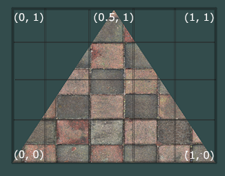
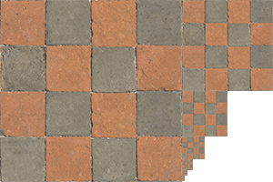

# Textures

[link to chapter](https://learnopengl.com/Getting-started/Textures)

Textures are a way for us to add more detail to our creations without adding lots of color data. Basically it's an
image (1–3D) that we use to add more detail to the vertices.

| Textures can also be used to store a large collection of arbitrary data to send to the shaders, but we'll leave that
for a different topic.

# Table of contents

* [Mapping](#mapping)
* [Texture Wrapping](#texture-wrapping)
* [Texture Filtering](#texture-filtering)
*
    * [Mipmaps](#mipmaps)
* [Loading and creating textures](#loading-and-creating-textures)
*
    * [Generating a texture](#generating-a-texture)
*
    * [Applying texture](#applying-texture)

# Mapping

we'll continue with the triangle example from before. In order to map the texture we want to the triangle, we'll need to
tell each vertex the corisponding coordinate of the texture. This will tell the shader where to sample the data
from.<br>
Texture coordinates are ranging from 0 to 1 in each axis.

for example, in this 2D image, we can see that the sampling (the proccess of getting the coordinates from the
texture)<br><br>


in code it would look like:

```c++
float texCoords[] = {
    0.0f, 0.0f,  // lower-left corner  
    1.0f, 0.0f,  // lower-right corner
    0.5f, 1.0f   // top-center corner
};
```

# Texture Wrapping

Texture coordinates _usually_ range from 0 to 1. But when we state coordinates outside this range, we'll get undefined
bhaviour.
The defualt bahviour is to repeat the pattern. We can override this behaviour by expliicitly state what type of pettern
we wish to do:

* <span style="color: #5373B4"> GL_REPEAT </span>: The default behavior for textures. Repeats the texture image.
* <span style="color: #5373B4"> GL_MIRRORED_REPEAT </span>: Same as GL_REPEAT but mirrors the image with each repeat.
* <span style="color: #5373B4"> GL_CLAMP_TO_EDGE </span>: Clamps the coordinates between 0 and 1. The result is that higher coordinates become clamped to the edge, resulting in a stretched edge pattern.
* <span style="color: #5373B4"> GL_CLAMP_TO_BORDER </span>: Coordinates outside the range are now given a user-specified border color.


Each of the aforementioned options can be set per coordinate axis (s, t (and r if you're using 3D textures) equivalent
to x,y,z) with the `glTexParameter*` function:

```c++
glTexParameteri(GL_TEXTURE_2D, GL_TEXTURE_WRAP_S, GL_MIRRORED_REPEAT);
glTexParameteri(GL_TEXTURE_2D, GL_TEXTURE_WRAP_T, GL_MIRRORED_REPEAT);
```

When we use the option <span style="color: #5373B4"> GL_CLAMP_TO_BORDER </span>, we sould also specify the color of the
border:

```c
float borderColor[] = { 1.0f, 1.0f, 0.0f, 1.0f };
glTexParameterfv(GL_TEXTURE_2D, GL_TEXTURE_BORDER_COLOR, borderColor);  
```

# Texture Filtering

Texture coordinates do not depend on resoloution, thus OpenGL has to figure out how to texture pixel (texel) to map the
coordinates to. We'll usually notice it more when we have large object with low resoloution.
There are many texture filtering options, but for now we'll duscuss inly two: `GL_NEAREST` and `GL_LINEAR`.

 <span style="color: #5373B4"> GL_NEAREST  </span>, which is the default, will pick the closest texel to the coordinates.


<span style="color: #5373B4"> GL_LINEAR </span> will interpolate between the two closest texels.


and now the affect of each method:


Texture filtering can be set for magnifying and minifying operations (when scaling up or downwards) so you could, for
example, use _nearest neighbor filtering_ when textures are scaled downwards and linear filtering for upscaled textures.
Thus, we have to specify the filtering method for both options via `glTexParameter*`.

```c
glTexParameteri(GL_TEXTURE_2D, GL_TEXTURE_MIN_FILTER, GL_NEAREST);
glTexParameteri(GL_TEXTURE_2D, GL_TEXTURE_MAG_FILTER, GL_LINEAR);
```

## MipMaps

When we want to render something small with high resoultion texture, we shouldn't waste a lot of bandwith on it. OpenGL
uses MipMpas for it. Basically it's a collection of textures, each one is twice as small from the prevous.



as the same with Texture Filtering, we can tell OpenGl how to sample the MipMaps

* <span style="color: #5373B4"> GL_NEAREST_MIPMAP_NEAREST </span>: takes the nearest mipmap to match the pixel size and uses nearest neighbor interpolation for texture sampling.
* <span style="color: #5373B4"> GL_LINEAR_MIPMAP_NEAREST </span>: takes the nearest mipmap level and samples that level using linear interpolation.
* <span style="color: #5373B4"> GL_NEAREST_MIPMAP_LINEAR </span>: linearly interpolates between the two mipmaps that most closely match the size of a pixel and samples the interpolated level via nearest neighbor interpolation.
* <span style="color: #5373B4"> GL_LINEAR_MIPMAP_LINEAR </span>: linearly interpolates between the two closest mipmaps and samples the interpolated level via linear interpolation.

```c
glTexParameteri(GL_TEXTURE_2D, GL_TEXTURE_MIN_FILTER, GL_LINEAR_MIPMAP_LINEAR);
glTexParameteri(GL_TEXTURE_2D, GL_TEXTURE_MAG_FILTER, GL_LINEAR);
```

# Loading and creating textures

Well, we need to load the image to the graphic card _somehow_. and each file fromat is diffrent. we could write our own
loaders, but that's a hustle.
we can use [stb_loaders](https://github.com/nothings/stb).

we'll download the file from [here](https://github.com/nothings/stb).

For this section, we'll use this [wooden container image](./resources/wooden_container.jpg)

```c
#include "stb_image.h"

int width, height, nrChannels;
unsigned char *data = stbi_load("wooden_container.jpg", &width, &height, &nrChannels, 0); 
```

## Generating a texture

As any other OpenGl object, we'll reference the texture with ID and bind it.

```c
unsigned int texture;
glGenTextures(1, &texture);  
/* or 
  unsigned int texture[];
    glGenTextures(5, &texture);
*/

glBindTexture(GL_TEXTURE_2D, texture);  

glTexImage2D(GL_TEXTURE_2D, 0, GL_RGB, width, height, 0, GL_RGB, GL_UNSIGNED_BYTE, data);
glGenerateMipmap(GL_TEXTURE_2D);    // optional

stbi_image_free(data); //once loaded, we souhld free the resource

```

let's explain the `glTexImage`:

* The first argument specifies the texture target; setting this to GL_TEXTURE_2D means this operation will generate a
  texture on the currently bound texture object at the same target (so any textures bound to targets GL_TEXTURE_1D or
  GL_TEXTURE_3D will not be affected).
* The second argument specifies the mipmap level for which we want to create a texture for if you want to set each
  mipmap level manually, but we'll leave it at the base level which is 0.
* The third argument tells OpenGL in what kind of format we want to store the texture. Our image has only RGB values so
  we'll store the texture with RGB values as well.
* The fourth and fifth argument set the width and height of the resulting texture. We stored those earlier when loading
  the image so we'll use the corresponding variables.
* The sixth argument should always be 0 (some legacy stuff).
* The seventh and eighth argument specify the format and datatype of the source image. We loaded the image with RGB
  values and stored them as chars (bytes) so we'll pass in the corresponding values.
* The last argument is the actual image data.

Once `glTexImage2D` is called, the currently bound texture object now has the texture image attached to it. However,
currently it only has the base-level of the texture image loaded and if we want to use `MipMaps` we have to specify all
the different images manually (by continually incrementing the second argument) or, we could call glGenerateMipmap after
generating the texture. This will automatically generate all the required mipmaps for the currently bound texture.

## Applying texture

Let's assume we've done [Hello triangle](../02_creating_triangle/creating_triangle.md/#creating-a-triangle).<br>
We'll need to inform OpenGl the how to sample the texture data:

```c
float vertices[] = {
    // positions          // colors           // texture coords
     0.5f,  0.5f, 0.0f,   1.0f, 0.0f, 0.0f,   1.0f, 1.0f,   // top right
     0.5f, -0.5f, 0.0f,   0.0f, 1.0f, 0.0f,   1.0f, 0.0f,   // bottom right
    -0.5f, -0.5f, 0.0f,   0.0f, 0.0f, 1.0f,   0.0f, 0.0f,   // bottom left
    -0.5f,  0.5f, 0.0f,   1.0f, 1.0f, 0.0f,   0.0f, 1.0f    // top left 
};

//and now we'll have to change the stride 
glVertexAttribPointer(2, 2, GL_FLOAT, GL_FALSE, 8 * sizeof(float), (void*)(6 * sizeof(float)));
glEnableVertexAttribArray(2);
```

Nnd now we'll have to change our vertex shader as well:

```glsl
#version 330 core
layout (location = 0) in vec3 aPos;
layout (location = 1) in vec3 aColor;
layout (location = 2) in vec2 aTexCoord; //now we have a 2D texture, for 3D we'll use vec3

out vec3 ourColor;
out vec2 TexCoord;

void main()
{
    gl_Position = vec4(aPos, 1.0);
    ourColor = aColor;
    TexCoord = aTexCoord;
}
```

The fragment shader should also have access to the texture object, but how do we pass the texture object to the fragment
shader? GLSL has a built-in data-type for texture objects called a sampler that takes as a postfix the texture type we
want.

```glsl
#version 330 core
out vec4 FragColor;
  
in vec3 ourColor;
in vec2 TexCoord;

uniform sampler2D ourTexture;

void main()
{
    FragColor = texture(ourTexture, TexCoord);
}
```

and now all we have to do is:

```c

glBindTexture(GL_TEXTURE_2D, texture);
glBindVertexArray(VAO);
glDrawElements(GL_TRIANGLES, 6, GL_UNSIGNED_INT, 0);
```