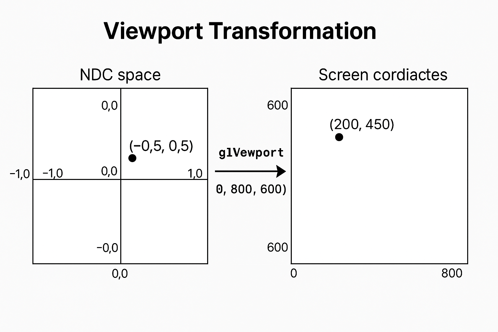

# Table of contents

* [Introduction](#introduction)
* [Specific topics](#topics)

# Introduction

## What is OpenGL

OpenGL is an API _specification_ of graphic manipulations developed and maintained by the Khronos Group.
Since this is only a specification, the actual libraries are developed and maintained by the graphic card's
manufacturer.

## Core topics

### State machine

You can relate to OpenGL as a state machine that operates on a _context_. To tell it what to draw, we declare, change,
and manipulate buffers and then render it.

### Objects

Usually, OpenGL libraries are written in C [^1]. Thus, we need c-style structs to interact with it. For example:

```c
#assumme_includes

struct window_object {
    float height;
    float width;
    char[] name;
    int option 3;
};

//the state
struct OpenGL_context {
    window_object* object_window_target;
    ...
};

int main() {
    unsigned int object_id = 0;
    glGenObject(1, &objectId); //generates an object and gives it ID
    glBindObject(GL_WINDOW_TARGET, object_id); // binds the object to a window
    
    // set options
    glSetObjectOption(GL_WINDOW_TARGET, GL_WINDOW_HEIGHT, 600);
    glSetObjectOption(GL_WINDOW_TARGET, GL_WINDOW_WIDTH, 800);
    
    //unsets context
    glBindObject(GL_WINDOW_TARGET, 0);
    
    ....
}
```

In the example above, in the `main` function, we saw a common flow in OpenGL:

1. generating an object and fet it's id
2. bind it to view
3. set its options
4. unbind so we can interract with other objects

### Viewport

Basically, the mapping of the rendering rectangle.<br>

Before we map anything to the screen, we need to normalize the coordinates to the window. To map (-1.0, -1.0) to 0,0
and (1.0,1.0) to (N, M).<br>
And in more technical terms: <br>Normalized Device Coordinates:<br>
* x, y, and z range from -1.0 to 1.0.
* (0,0) is the center of the viewport.
* (-1,-1) is the bottom-left corner of the viewport.
* (1,1) is the top-right corner.

example image:


[More info from wikipedia](https://en.wikipedia.org/wiki/Viewport)

# Topics

1. [Creating window](01_creating_window/creating_window.md)
2. [Crating triangles](02_creating_triangle/creating_triangle.md)
3. [Shaders](03_shaders/shaders.md)

[^1]: Citation needed.